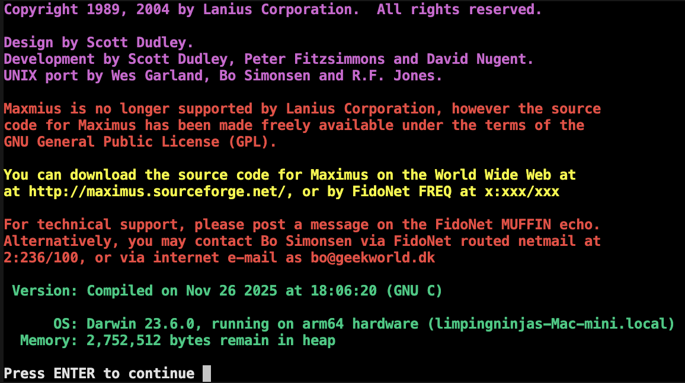

# Maximus BBS

A classic bulletin board system from the DOS/OS2 era, now running on modern UNIX systems.



## What is This?

Maximus was one of the premier BBS packages of the early 90s, developed by Scott Dudley and Lanius Corporation. It supported FidoNet messaging, file transfers, MEX scripting, and all the features that made BBSing great. The source was released under GPL after Lanius ceased operations.

This fork focuses on getting Maximus compiling and running on modern systems - particularly macOS (including ARM64/Apple Silicon) - so folks who want to relive the BBS days or run a retro board can actually do so without hunting down a DOS emulator or vintage hardware.

## Current Status

**Working:**
- Full build on macOS (Darwin) including ARM64
- All libraries compile cleanly
- MEX scripting compiler and VM
- MAID, SILT, MECCA and other utilities  
- Local login via `max -c`

**In Progress:**
- Telnet server integration (maxcomm exists but needs testing)
- Cross-compilation targets for other platforms
- Packaging and release automation

**Untested:**
- Linux builds (should work, just haven't tried recently)
- FreeBSD/Solaris (historically supported)
- Actual telnet connectivity

## Quick Start

```bash
# Extract the configuration files
tar -xzvf install_tree.tar.gz

# Configure for local build
./configure --prefix=$(pwd)/build

# Build everything
make build

# Install (copies configs, compiles control files, etc.)
make install

# Test it out
cd build
bin/max etc/max -c
```

See [BUILD.md](BUILD.md) for detailed instructions, environment setup, and troubleshooting.

## Why?

Sometimes you just want to make sure old code still runs. I like picking up retro projects, getting them to compile on modern systems, maybe adding a feature or two, and leaving them around for others who share the interest. Maximus seemed like it deserved to keep running.

If you're into BBS history, FidoNet nostalgia, or just appreciate software archaeology, feel free to poke around. Pull requests welcome if you get something working that I haven't.

## History

- **1989-2004**: Developed by Lanius Corporation
- **~2003**: UNIX port by Wes Garland, Bo Simonsen, and R.F. Jones
- **2025**: macOS/ARM64 modernization by LimpingNinja (Kevin Morgan)

## License

GNU General Public License (GPL). See [LICENSE](LICENSE) for details.

## Links

- [Original Maximus Site](http://maximus.sourceforge.net/) (historical)
- [BUILD.md](BUILD.md) - Build instructions and documentation
- [FidoNet](https://en.wikipedia.org/wiki/FidoNet) - If you're wondering what all this FREQ/netmail stuff is about
